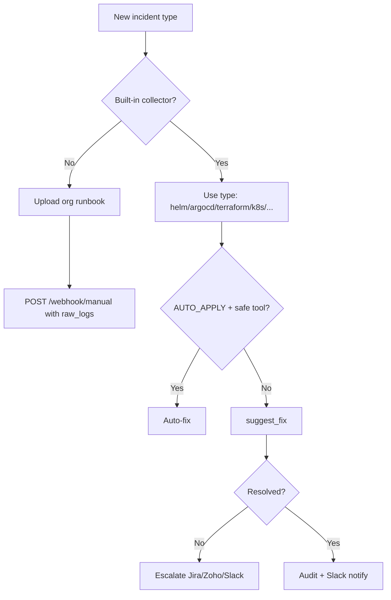

# Coverage Gaps — How to Handle What the Agent Does Not Auto-Fix

This guide explains the **five strategies** for incidents outside core auto-remediation, plus **Helm**, **ArgoCD**, **Terraform**, and how to extend further.

---

## The five strategies (use in order)

```text
1. Org runbooks     → teach the agent your stack-specific steps
2. Manual webhook   → feed odd incidents with logs/context
3. suggest_fix      → agent writes exact safe commands (fallback)
4. Escalation       → Jira / Zoho / Slack / email when stuck
5. Extend agent     → add collectors + tools (plugin-style)
```

---

## 1. Org runbooks (`/orgs/{org}/docs`)

Upload runbooks so Claude sees them on every incident for that org.

**Examples to upload:**

| Path | Use for |
|------|---------|
| `runbooks/helm-rollback.md` | Chart rollback procedure per release |
| `runbooks/argocd-sync.md` | When to sync vs rollback ArgoCD apps |
| `runbooks/terraform-drift.md` | Who approves `terraform apply` |
| `runbooks/disk-full.md` | Safe cleanup paths on your servers |
| `runbooks/rds-timeout.md` | App-layer steps when DB alerts fire |

**Upload:**

```bash
curl -X POST "http://localhost:8000/orgs/acme-corp/docs/upload?path=runbooks/helm-rollback.md" \
  -H "X-Org-ID: acme-corp" \
  -F "file=@helm-rollback.md"
```

Runbooks are injected into the agent user message automatically.

---

## 2. Manual webhook (odd / custom issues)

Use when Alertmanager/GitHub webhooks don't fit.

```bash
curl -X POST http://localhost:8000/webhook/manual \
  -H "Content-Type: application/json" \
  -H "X-Org-ID: acme-corp" \
  -d '{
    "type": "helm",
    "release_name": "api",
    "namespace": "production",
    "description": "Helm upgrade failed — hook timeout",
    "raw_logs": "Error: pre-upgrade hook job api-migrate failed"
  }'
```

**Supported `type` values:**

| type | Key context fields |
|------|-------------------|
| `server` | `host`, `raw_logs`, `description` |
| `k8s` | `namespace`, `pod` |
| `helm` | `release_name`, `namespace` |
| `argocd` | `app_name` |
| `terraform` | `workspace_path` |
| `cicd` | `repo`, `run_id`, `platform` |
| `cloud_aws` / `cloud_gcp` / `cloud_azure` | `resource_type`, `resource_id` |

---

## 3. suggest_fix (fallback when tools can't auto-fix)

Used when:

- `AUTO_APPLY=false`
- Command blocked (delete, uninstall, firewall change)
- Terraform **apply** needed (plan-only is built-in)
- Collector partial failure

Output: non-destructive commands, YAML/HCL snippets, verification steps → Slack + audit `suggested_fixes`.

---

## 4. Escalation (Jira / Zoho / Slack / email)

Auto-triggers when:

- Timeout without resolution (`ESCALATION_TIMEOUT_MINUTES`)
- Database incident (`ENABLE_DATABASE_COLLECTION=false`)
- Agent error / not grounded
- Max steps reached

Configure in `.env`:

```bash
ESCALATION_ENABLED=true
ESCALATION_CHANNELS=slack,email,jira
JIRA_URL=...
ZOHO_DESK_ORG_ID=...
```

---

## 5. Extend the agent (plugin-style)

Add a new integration in four steps:

| Step | File | Purpose |
|------|------|---------|
| 1 | `collectors/<name>.py` | Gather evidence on incident start |
| 2 | `tools/<name>_tools.py` | Safe remediation actions |
| 3 | `agent/prompts.py` | Specialist system prompt |
| 4 | `agent/core.py` | Register tools + wire `_collect_context` / `_execute_tool` |

Also update: `agent/classifier.py`, `agent/grounding.py` (evidence/remediation tool sets).

---

## Helm (now built-in)

| Tool | What it does |
|------|----------------|
| `get_helm_release` | status, history, values, manifest preview |
| `helm_rollback` | Roll back to previous revision |
| `helm_upgrade` | Upgrade with `--dry-run` first |

**Blocked:** `helm uninstall`, `helm delete`

**Webhook example:**

```json
{
  "type": "helm",
  "release_name": "payments-api",
  "namespace": "production",
  "description": "Helm upgrade hook failed"
}
```

**Requirements:** `helm` CLI on agent host, `KUBECONFIG` or in-cluster config, `ALLOWED_NAMESPACES`.

---

## ArgoCD (built-in)

| Tool | What it does |
|------|----------------|
| `get_argocd_status` | App health, sync state, resources |
| `get_argocd_history` | Deployment history |
| `sync_argocd_app` | Sync (dry-run first) |
| `rollback_argocd_app` | Rollback to previous Git revision |

**Configure:** `ARGOCD_SERVER_URL`, `ARGOCD_AUTH_TOKEN`

**Webhook example:**

```json
{
  "type": "argocd",
  "app_name": "payments-api",
  "description": "Application OutOfSync — degraded"
}
```

---

## Terraform / IaC (read-only built-in)

| Tool | What it does |
|------|----------------|
| `terraform_validate` | Syntax/module validation |
| `terraform_plan` | Drift detection (read-only) |

**Blocked:** `terraform apply`, `destroy`, `import`, `taint`

For apply: agent uses **suggest_fix** with exact `terraform apply` steps for humans.

**Webhook example:**

```json
{
  "type": "terraform",
  "workspace_path": "/opt/terraform/live/prod",
  "description": "Drift detected on ALB target group"
}
```

**Env:** `TERRAFORM_WORKSPACE_DIR` (optional default), `TERRAFORM_BIN=terraform`

---

## Still not auto-fixed (use runbook + suggest_fix + escalate)

| Area | Strategy |
|------|----------|
| DNS (Route53, Cloudflare) | Manual webhook + runbook + suggest_fix |
| SSL/cert renewal | `run_shell_command` check + suggest_fix |
| Vault/secrets rotation | Runbook + escalate |
| Helm uninstall | Blocked — rollback or manual |
| Terraform apply | suggest_fix + human apply |
| Firewall / security groups | suggest_fix only |
| CircleCI / Bitbucket CI | Manual webhook `type: cicd` with `raw_logs` |
| VMware / on-prem | `type: server` + SSH `host` |

---

## Quick decision tree



---

## Related docs

- [API_REFERENCE.md](API_REFERENCE.md) — webhook fields
- [ESCALATION.md](ESCALATION.md) — escalation config
- [GETTING_STARTED.md](GETTING_STARTED.md) — deploy agent + `AUTO_APPLY`
- [PLATFORM_SUPPORT.md](PLATFORM_SUPPORT.md) — full platform matrix
